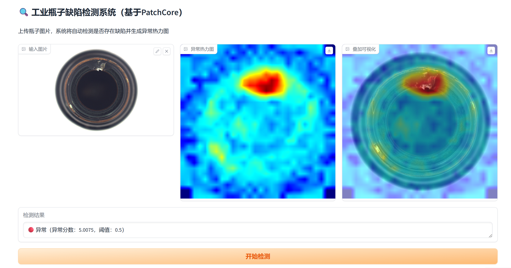

# 🔍 工业缺陷检测系统（基于 PatchCore）

> 复现 CVPR 2022 PatchCore 算法，实现无监督工业表面缺陷检测，在 MVTec AD bottle 类别上达到 **Image-level AUROC 1.0**
> 

   

---

## 📌 项目简介

工业质检场景中，缺陷样本天然稀少，有监督检测方法（如 YOLO）需要大量标注数据，难以落地。本项目复现 **PatchCore（CVPR 2022）** 无监督异常检测算法，**仅使用正常品图片完成训练**，无需任何缺陷标注，更贴近真实工业场景。

**核心思路：** 用预训练 ResNet50 提取正常品的 Patch 级特征，构建记忆库；推理时计算待检图片特征与记忆库的最近邻距离，距离越大的区域越异常。

---

## 🎯 实验结果

| 数据集 | 类别 | Image-level AUROC | 论文基准 |
|--------|------|:-----------------:|:-------:|
| MVTec AD | bottle | **1.0000** | 0.998 |

---

## 🖼️ 效果展示

| 输入图片 | 异常热力图 | 叠加可视化 |
|---------|-----------|-----------|
| 瓶口裂缝缺陷 | 红色区域精准定位缺陷 | 热力图与原图融合 |

> 红色 = 高异常区域，蓝色 = 正常区域

---

## 🏗️ 算法原理

```
【训练阶段】仅用正常品图片
        ↓
用预训练 ResNet50 提取多尺度特征
  · layer1 输出 [256, 56, 56]  ← 捕捉纹理细节
  · layer2 输出 [512, 28, 28]  ← 捕捉结构信息
        ↓
融合两层特征 → [768, 28, 28]（每张图 784 个 patch）
        ↓
CoreSet 采样压缩至 10% → 构建记忆库 Memory Bank

【推理阶段】输入待检测图片
        ↓
同样提取 Patch 特征
        ↓
计算每个 patch 与记忆库最近邻的距离
        ↓
距离越大 → 越异常 → 生成异常热力图
```

**为什么用 CoreSet 采样？**
原始记忆库有 16 万条特征，推理时逐一比对极慢。CoreSet 贪心选出最具代表性的子集，压缩到 10%，在几乎不损失精度的情况下大幅提升查询速度。

---

## 📁 项目结构

```
patchcore-defect-detection/
├── data/
│   └── mvtec/
│       └── bottle/          # MVTec AD 数据集
│           ├── train/good/  # 训练用正常品（209张）
│           └── test/        # 测试集（含4类缺陷）
├── src/
│   ├── feature_extractor.py # ResNet50 多尺度特征提取
│   ├── memory_bank.py       # CoreSet 采样 + 最近邻查询
│   ├── dataset.py           # MVTec 数据集加载
│   └── anomaly_detector.py  # 推理 + 热力图生成
├── train.py                 # 构建记忆库
├── evaluate.py              # 评估 AUROC
├── app.py                   # Gradio 可视化界面
└── requirements.txt
```

---

## ⚙️ 环境安装

```bash
# 1. 创建虚拟环境
conda create -n patchcore python=3.9 -y
conda activate patchcore

# 2. 安装依赖
pip install torch torchvision --index-url https://download.pytorch.org/whl/cpu
pip install scikit-learn opencv-python matplotlib tqdm gradio==3.50.2
pip install huggingface_hub==0.25.2
```

---

## 🚀 快速开始

### 1. 下载数据集
前往 [MVTec AD 官网](https://www.mvtec.com/company/research/datasets/mvtec-ad/downloads) 下载 `bottle.tar.xz`，解压到 `data/mvtec/` 目录下。

### 2. 训练（构建记忆库）
```bash
python train.py
# 输出：memory_bank.pt（CPU约需1小时）
```

### 3. 评估
```bash
python evaluate.py
# 输出：Image-level AUROC: 1.0000
```

### 4. 启动可视化界面
```bash
python app.py
# 浏览器访问 http://127.0.0.1:7860
```

---

## 📦 依赖版本

| 库 | 版本 |
|----|------|
| Python | 3.9 |
| PyTorch | 2.8.0+cpu |
| Torchvision | 0.23.0+cpu |
| OpenCV | 4.13.0 |
| scikit-learn | latest |
| Gradio | 3.50.2 |

---

## 📄 参考论文

> Roth, K., et al. **"Towards Total Recall in Industrial Anomaly Detection."**
> *CVPR 2022.* [[Paper]](https://arxiv.org/abs/2106.08265)

---

## 🙋 作者

> 如有问题欢迎提 Issue 或联系作者。